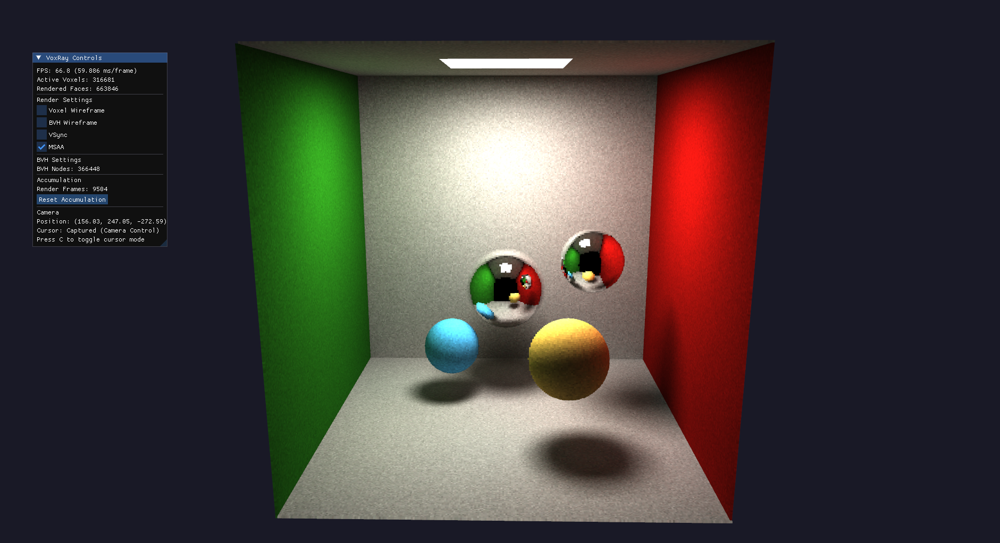

# OpenGL Voxel Path Tracer

## Compilation
You need glfw3 and CMake installed on your system. Then run:

```bash
git clone --recurse-submodules https://github.com/RaphaelAsla/VoxRay.git
cd VoxRay && mkdir -p build && cd build
cmake .. -DCMAKE_BUILD_TYPE=Release
cmake --build . -- -j$(nproc)
./VoxRay
```

## Keybinds
Use WASD for standard movement <br>
Press Shift/Space to move Down/Up <br>
Press C to capture/release mouse from camera <br>
Press ESC to quit

## Preview
<p align="center">
  
</p>
